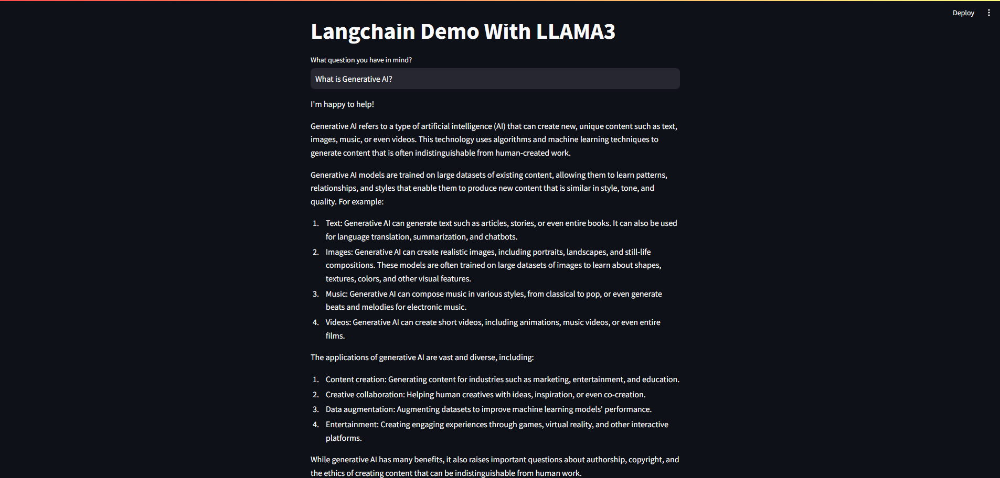

<h1 align="center">⚡ LangChain Demo with LLaMA 3 & Streamlit</h1>

<p align="center">
  A lightweight, local-first AI assistant powered by <b>Ollama</b>, <b>LangChain</b>, and <b>Streamlit</b>.
</p>

---

<!-- BADGES -->
<p align="center">
  
  
  
  
  
</p>

---

## 📌 Overview

This project demonstrates how to build an interactive AI application using:

- **LLaMA 3 (via Ollama)**
- **LangChain** for prompt management and chaining  
- **Streamlit** for a clean and responsive UI  
- **LangSmith** for tracing & debugging  

It serves as a minimal yet complete example of building local LLM apps.

---

## 📸 Demo Preview (Optional)


<p align="center">
  
</p>

---

## 🧠 Features

- Local inference with **Ollama + LLaMA3**
- Clean prompt–LLM–output chain via **LangChain**
- Easy UI built with Streamlit
- Integrated LangSmith logging
- Fully extensible structure for chatbots, agents, and RAG systems

---

## 🚀 Getting Started

### 1️⃣ Clone the Repository

```bash
git clone <your-repo-url>
cd <your-project-folder>
```

2️⃣ Install Dependencies
```
pip install -r requirements.txt
```
3️⃣ Install Ollama + LLaMA3
Download Ollama:
https://ollama.com/download

Pull the model:
```
ollama pull llama3
```
4️⃣ Create a .env File
```
LANGCHAIN_API_KEY=your_langchain_api_key
LANGCHAIN_PROJECT=your_project_name
```
5️⃣ Run the App
```
streamlit run app.py
```
🧩 Code Structure
```
.
├── app.py
├── .env
├── README.md
├── requirements.txt
└── assets/
     ├── banner.png
     └── demo.gif

```

🧠 Core Chain Example
```

chain = prompt | llm | output_parser
response = chain.invoke({"question": input_text})
```

🛠 Technologies Used
Python 3.10+
Streamlit
LangChain
LangChain Community
Ollama
LLaMA 3
dotenv
LangSmith

---

📜 License
This project is licensed under the MIT License.

⭐ Contributing
Pull requests are welcome!
If you like this project, please ⭐ star the repo.

📬 Contact
For issues, suggestions, or improvements — feel free to open an issue.

